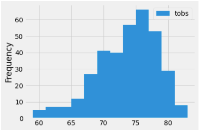
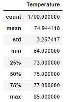
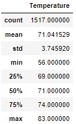

# Challenge9

## Overview of the analysis 

Our main target is to ensure financing for a Surf n' Shake shop server located in Hawaii, to do so, we created a Formal Business Plan and reached a local famous investor named W. Avy. To support the investment decision, we analyzed Oahu's historical weather information to ensure is appropriate for the business:

In general, it seems most days' temperatures range from 70 to 80 Fahrenheit degrees, nevertheless, the final request is to analyze specifically June and December to ensure the business is sustainable year-round. 

## Results 

The performed statistical analysis executed over June and December figures are shown below: 

June's Statistics: 

December's Statistics: 

Note: 

1) Average for both months range in the lower part of the temperatures (70 to 74) but still in desirable level. 
2) December's Q1 is a little bit out of the desirable Range, implying may see a reduction in sales.
3) June's figures shows would be a good month for sales due to adequate temperates. 

## Summary 

Oahu's historical weather information provides statistical support to the factibility to open a Surf n' Shake shop, the temperature tends to range from 70 to 80 Fahrenheit degrees with some minor deviations during December, the typical cold month.

Weather conditions seem ideal to provide conditions for the store to succeed based on the developed Business Plan, nevertheless, to materialize the opportunity investment is needed. 
